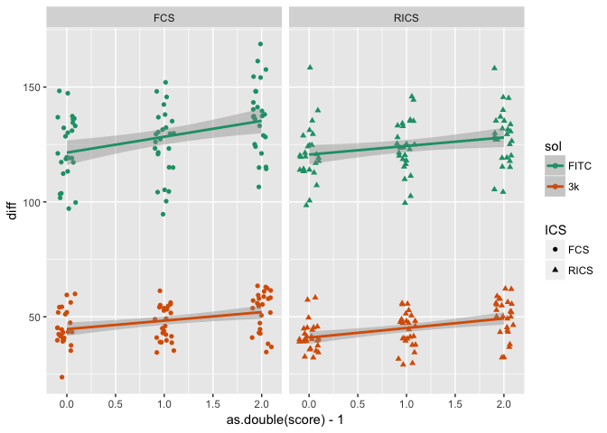

# Study of Solute Diffusion in Osteoarthritic Human Cartilage
Analysis of diffusivity of molecules in osteoarthritic human cartilage as measured by image correlation spectroscopy techniques.  This repo contains all of the collated data, analyses, and code used to generate the plots for the submitted publication.

Check out the exploratory_analysis/exploratory_analysis.md file for a good overview of the study with early visualizations of the data.  Otherwise, a brief synopsis can be found below.  We just submitted a manuscript of this study for publication, but I will post a link to the article if/when it is published.

__Overview:__ Multiple 3mm cartilage plugs of varying OA severity (ICRS grading system) were pulled from the tissue removed from patients undergoing total knee arthroplasty.  Samples were saturated in FITC and 3k Texas Red Dextran solutions and imaged using both FCS and RICS (Image correlation spectroscopy techniques) to quantify the [diffusion coefficients of each molecule](https://link.springer.com/article/10.1007%2Fs10439-017-1869-6).  Samples were also [characterized mechanically](http://tribology.asmedigitalcollection.asme.org/article.aspx?articleid=2502350) and [chemically](https://www.ncbi.nlm.nih.gov/pubmed/15299214) to yield modulus, permeability, and compositional data.

__Hypothesis:__ The main hypothesis was that diffusivity would increase with OA severity.  We also are interested to see if we can detect changes in the mechanical and compositional properties that would be associated with diffusivity changes.

__Results:__
Here is some preliminary data.  ICRS score is on the x axis and diffusivity is on the y axis.  FITC is about 1/3 of the molecular weight of 3k Dextran and has a much smaller diffusion coefficient.  The diffusivity of both solutes increases with increasing OA severity (higher ICRS score).  

