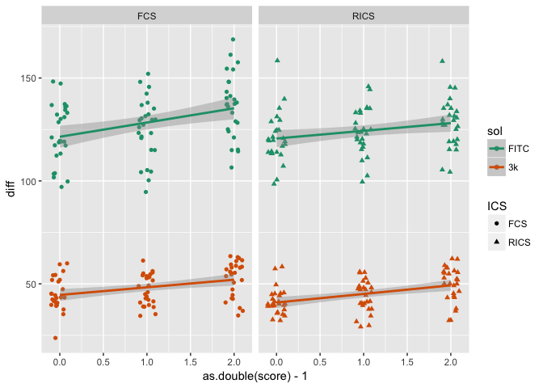

# Human OA Diffusion Study: Exploratory Analysis
Brian Graham  

This notebook provides a first look at the data aquired as part of the FCS/RICS study of human osteoarthritic (OA) cartilage.

__Overview:__ Multiple 3mm cartilage plugs of varying OA severity (ICRS grading system) were pulled from the tissue removed from patients undergoing total knee arthroplasty.  Samples were saturated in FITC and 3k Texas Red Dextran solutions and imaged using both FCS and RICS (Image correlation spectroscopy techniques) to quantify the diffusion coefficients of each molecule.  Samples were also characterized mechanically and chemically to yeild modulus, permeability, and compositional data.


__Hypothesis:__ The main hypothesis was that diffusivity would increase with OA severity.  We also are interested to see if we can detect changes in the mechanical and compositional properties that would be associated with diffusivity changes.

__End Goal:__ With arthroscopic microscopy instruments becoming more advanced, sophisticated imaging techiques like FCS and RICS could be used to identify OA before macrscopic damage occurs, by detecting sublte changes in the diffusivity of small molecules that would indicate alterations in the tissue matrix.

## Data
### Import Data
Import the raw data from the excel file

```r
library(tidyverse)
```

```
## Loading tidyverse: ggplot2
## Loading tidyverse: tibble
## Loading tidyverse: tidyr
## Loading tidyverse: readr
## Loading tidyverse: purrr
## Loading tidyverse: dplyr
```

```
## Conflicts with tidy packages ----------------------------------------------
```

```
## filter(): dplyr, stats
## lag():    dplyr, stats
```

```r
library(readxl)
library(forcats)

# Import raw data
fullpath <- "~/Dropbox/Manuscripts/2018 FCS and RICS/data_and_stats/HumanCartilageStudy_Patients1_5.xlsx"
df <- read_excel(fullpath)

df
```

```
## # A tibble: 78 x 12
##    Patient `Plug No.` `ICRS Score` `FCS FITC` `RICS FITC` `FCS 3k Tred`
##      <chr>      <dbl>        <dbl>      <dbl>       <dbl>         <dbl>
##  1  0621.1          1            0  134.50041   131.23879      59.49256
##  2  0621.1          2            0   99.74422    98.51734      41.59801
##  3  0621.1          3            0   97.08711   107.23506      56.23685
##  4  0621.1          4            0  117.31468   113.97305      43.15423
##  5  0621.1          5            0  103.45330   100.56960      44.43965
##  6  0621.1          6            1  114.98434   121.35642      45.96168
##  7  0621.1          7            1  104.53726   109.88129      34.45221
##  8  0621.1          8            1  126.12799   111.33091      41.48222
##  9  0621.1          9            1  115.08055   120.38930      54.62741
## 10  0621.1         10            1  105.26341   118.60383      55.05647
## # ... with 68 more rows, and 6 more variables: `RICS 3k TRed` <dbl>,
## #   `Ey-` <dbl>, `Ey+` <dbl>, M <dbl>, k0 <dbl>, `R^2` <dbl>
```
Note that there were 78 samples.  To while each sample has 4 mechanical property measurements, diffusion of 2 solutes was measured for each sample, using two different techniques for each solute.

### Tidy Data
The data needs to be tidy before we do any analysis of diffusion coefficients and damage score.  We'll convert patient, plug, and ICRS score to factors and create new variables  to denote the imaging technique and solute used for each observation.  Here is summary of our variable types:

__Predictors__  

Name | Variable Type | Description  
---- | ------------- | ------------------------------------------------------------------  
pat  | nominal | patient number (n = 5)  
plug | nominal | number of plug that was taken from patient (14-16 per patient)  
score | ordinal | ICRS cartilage OA score (range evaluated = 0-2, higher number = increasing severity)  
ICS | nominal | Image correlation spectroscopy method (FCS or RICS)  
sol | nominal | Solute FITC or 3k Dextran Texas Red)  

__Response Variables__

Name | Variable Type | Description  
---- | ------------- | ------------------------------------------------------------------  
diff  | continuous | Diffusion Coefficient
modcomp | continuous | Compressive Modulus
modten | continuous | Tensile Modulus
perm_m | continuous | Permeability exponential coefficient
perm_k0 | continuous | Permeability scalar coefficient
mechr2 | continuous | R-squared value for mechanical property fit


```r
# Rename columns
namestr <- c("pat","plug","score","FCS_FITC","RICS_FITC","FCS_3k","RICS_3k","modcomp","modten","perm_m","perm_k0","mechr2")
names(df) <- namestr

# Convert to factors
df$pat <-as_factor(df$pat)
df$plug <- as.character(df$plug) %>% as_factor()
df$score <- as.character(df$score) %>% ordered()

# Reorder patient levels
levels(df$pat) <- levels(df$pat)[c(5,3,4,1,2)]

# Gather diffusion measurements in a single column
df <- df %>% gather("FCS_FITC","RICS_FITC","FCS_3k","RICS_3k", key = "ICS_molecule",value = "diff")

# Separate ICS technique and solute. Covnert to factors
df <- df %>% 
    separate(ICS_molecule, into = c("ICS","sol"))
df$ICS <-as_factor(df$ICS)
df$sol <-as_factor(df$sol)
# rearrange column order
df <- df %>%
    select(pat:score,ICS:diff,everything())

df
```

```
## # A tibble: 312 x 11
##       pat   plug score    ICS    sol      diff   modcomp    modten
##  * <fctr> <fctr> <ord> <fctr> <fctr>     <dbl>     <dbl>     <dbl>
##  1 0614.1      1     0    FCS   FITC 134.50041 0.5864212  7.353148
##  2 0614.1      2     0    FCS   FITC  99.74422 0.5676965 11.120555
##  3 0614.1      3     0    FCS   FITC  97.08711 0.4804499  7.457586
##  4 0614.1      4     0    FCS   FITC 117.31468 0.9254228 10.313120
##  5 0614.1      5     0    FCS   FITC 103.45330 0.5584437 13.658667
##  6 0614.1      6     1    FCS   FITC 114.98434 0.3972975 10.692987
##  7 0614.1      7     1    FCS   FITC 104.53726 0.4087772 12.562970
##  8 0614.1      8     1    FCS   FITC 126.12799 0.1353743  5.813416
##  9 0614.1      9     1    FCS   FITC 115.08055 0.7838630  5.965129
## 10 0614.1     10     1    FCS   FITC 105.26341 0.5142114  6.823431
## # ... with 302 more rows, and 3 more variables: perm_m <dbl>,
## #   perm_k0 <dbl>, mechr2 <dbl>
```
Note that now there at 78 * 4 = 312 rows since we are considering each diffusion measurement to be a single observation.

## Exploring the data
### Diffusivity
First, let's get a broad overview of our data just looking at how our measurements vary with OA score.

```r
ggplot(df, aes(x = score, y = diff, color = sol, shape = ICS)) + 
  geom_jitter(width = 0.1, height = 0) +
  scale_colour_brewer(palette = "Dark2")
```

<!-- -->
The expected effect of molecule size on diffusivity is obvious here.  3k dextran is almost 10 times larger than FITC.  Thus, we would expect it to have a much lower diffusivity.  It's hard to tell the difference between the two imaging techniques so let's break them out.  We'll also fit to a linear model to get trendlines and confidence intervals for each technique and solute.

```r
ggplot(df, aes(x = as.double(score)-1, y = diff, color = sol, shape = ICS)) + 
  geom_jitter(width = 0.1, height = 0) +
  geom_smooth(method = "lm") +
  facet_wrap(~ ICS) +
  scale_colour_brewer(palette = "Dark2")
```

<!-- -->
It appears that diffusivity increases with increasing OA score, for both measurement techniques and solutes.  Now let's see how close the measurements for FCS and RICS are by plotting diffusivity grouped by measurement technique.

```r
dfICS <- spread(df, key = ICS, value = diff);
ggplot(dfICS, aes(x = FCS, y = RICS)) +
    geom_point(aes(color = sol)) +
    geom_smooth(method = "lm") +
    scale_colour_brewer(palette = "Dark2")
```

<!-- -->
There is a tight linear relationship between the measurement techniques.  They might differ by solute size though.  Let's check.

```r
ggplot(dfICS, aes(x = FCS, y = RICS)) +
    geom_point(aes(color = sol)) +
    geom_smooth(method = "lm", aes(group = sol)) +
    scale_colour_brewer(palette = "Dark2")
```

<!-- -->
It looks like the slopes are about the same but that there is an offset (different intercepts) between sizes.

### Mechanical Properties
Do mechanical properties vary with score?  We'll plot keep using a continuous score variable so we can fit a linear model to the data.

First, we need to reorganize the data since the mechanical properties are repeated 4 times with each diffusion measurement (78 samples * 4 = 312).  We'll spread the single column of diffusion measurments back across 4 columns for teh 4 combinations of solute size and imaging tenchinque.

```r
# There are repeats of mechanical properties since diffusion is measured 4 ways per sample
# Properties are only measured once.  We need to spread the data after uniting the solute and ICS columns.
dfmech <-  df %>% 
    unite("sol_ICS",c("sol","ICS")) %>% 
        spread(key = sol_ICS, value = diff)
dfmech
```

```
## # A tibble: 78 x 12
##       pat   plug score   modcomp    modten    perm_m     perm_k0    mechr2
##  * <fctr> <fctr> <ord>     <dbl>     <dbl>     <dbl>       <dbl>     <dbl>
##  1 0614.1      1     0 0.5864212  7.353148  8.566763 0.002736889 0.9984358
##  2 0614.1      2     0 0.5676965 11.120555  7.979659 0.003210007 0.9997034
##  3 0614.1      3     0 0.4804499  7.457586  6.669643 0.002208729 0.9990778
##  4 0614.1      4     0 0.9254228 10.313120  7.773044 0.002833972 0.9998175
##  5 0614.1      5     0 0.5584437 13.658667  8.327737 0.003457160 0.9998880
##  6 0614.1      6     1 0.3972975 10.692987  7.363747 0.003896604 0.9962824
##  7 0614.1      7     1 0.4087772 12.562970 10.936814 0.002320523 0.9979397
##  8 0614.1      8     1 0.1353743  5.813416  5.840793 0.001271573 0.9999033
##  9 0614.1      9     1 0.7838630  5.965129 15.617600 0.005740468 0.9979764
## 10 0614.1     10     1 0.5142114  6.823431 13.973279 0.002237006 0.9989785
## # ... with 68 more rows, and 4 more variables: `3k_FCS` <dbl>,
## #   `3k_RICS` <dbl>, FITC_FCS <dbl>, FITC_RICS <dbl>
```

Now we can take a look at how each property varies with damage score. Recall the 4 mechanical properties that we measured for each sample:

Name | Description  
---- | ------------------------------------------------------------------  
modcomp | Compressive Modulus
modten | Tensile Modulus
perm_m | Permeability exponential coefficient
perm_k0 | Permeability scalar coefficient

```r
# Now we can plot using the new dataset
ggplot(dfmech,aes(as.double(score)-1,modcomp)) + 
  geom_jitter(width = 0.025, height = 0,aes(color = pat)) + 
  geom_smooth(method = "lm")
```

<!-- -->

```r
ggplot(dfmech,aes(as.double(score)-1,modten)) + 
  geom_jitter(width = 0.025, height = 0,aes(color = pat)) + 
  geom_smooth(method = "lm")
```

<!-- -->

```r
ggplot(dfmech,aes(as.double(score)-1,perm_m)) + 
  geom_jitter(width = 0.025, height = 0,aes(color = pat)) + 
  geom_smooth(method = "lm")
```

<!-- -->

```r
ggplot(dfmech,aes(as.double(score)-1,perm_k0)) + 
  geom_jitter(width = 0.025, height = 0,aes(color = pat)) + 
  geom_smooth(method = "lm")
```

<!-- -->
The data appear to indicate that both compressive and tensile moduli decrease while both permeability parameters increase.  This matches what the literature says about mechanical changes and OA severity.

Looking at the colors for each patient, there is no clear stratification (i.e. we don't see one patient consistently being at the top or bottom of a property ranges across multiple scores).  Now may be a good time to look at patient variability.

## Patient Variability
### Mechanical Properties 

First we will look at the compressive and tensile moduli

```r
ggplot(dfmech,aes(as.double(score)-1,modcomp,color = pat)) + 
  geom_jitter(width = 0.025, height = 0) + 
  geom_smooth(method = "lm") +
  facet_wrap(~pat,nrow = 2)
```

<!-- -->

```r
ggplot(dfmech,aes(as.double(score)-1,modten,color = pat)) + 
  geom_jitter(width = 0.025, height = 0) + 
  geom_smooth(method = "lm") +
  facet_wrap(~pat,nrow = 2)
```

<!-- -->
The slopes bewteen patients vary quite a bit, but almost all trend downward with increasing score.  We expected a lot of noise to the data since our method of scoring the cartilage was a newly trained graduate student as opposed to an experienced orthopedic surgeon, who would normally be the one using the ICRS system to score cartilage.


```r
ggplot(dfmech,aes(as.double(score)-1,perm_m,color = pat)) + 
  geom_jitter(width = 0.025, height = 0) + 
  geom_smooth(method = "lm") +
  facet_wrap(~pat,nrow = 2)
```

<!-- -->

```r
ggplot(dfmech,aes(as.double(score)-1,perm_k0,color = pat)) + 
  geom_jitter(width = 0.025, height = 0) + 
  geom_smooth(method = "lm") +
  facet_wrap(~pat,nrow = 2)
```

<!-- -->

Almost all permeability measure increase with increasing score with juts one outlier.

Are their similar outliers in teh permeability trends across damage score?  Let's investigate

### Diffusivity - Patient Variability

```r
ggplot(df, aes(x = as.double(score)-1, y = diff,color = pat)) + 
  geom_jitter(width = 0.025, height = 0, aes(shape = sol)) +
  geom_smooth(method = "lm",aes(linetype = sol)) +
  facet_grid(ICS ~ pat)
```

<!-- -->
It looks like our friend and previous outlier, patient 0614.2, follow the diffusion trends for the most part, the only exception being maybe a slight decrease in FITC diffusivity with damage score when measured with FCS.

## Correlations

Diffusivity is determined by a combination molecular and environment properties.  More permeability matrices mean there is less material for molecules to intereact with, thus resulting in higher diffusivity.  We would expect to see some correlation between diffusivity and permeability values but not modulus values. 

Permeability is up first.

```r
ggplot(df, aes(x = perm_k0, y = diff)) +
    geom_point(aes(color = score, shape = score)) +
    geom_smooth(method = "lm") +
    facet_grid(ICS ~ sol)
```

<!-- -->

```r
ggplot(df, aes(x = perm_m, y = diff)) +
    geom_point(aes(color = score, shape = score)) +
    geom_smooth(method = "lm") +
    facet_grid(ICS ~ sol)
```

<!-- -->
It looks like strong upward trends for FITC, and very slight upwad trends for 3k dextran, for bot hof the permeability parameters.  This checks out with our mechanistic udnerstanding of diffusion in cartilage.

Now let's look at the moduli.

```r
ggplot(df, aes(x = modcomp, y = diff)) +
    geom_point(aes(color = score, shape = score)) +
    geom_smooth(method = "lm") +
    facet_grid(ICS ~ sol)
```

<!-- -->

```r
ggplot(df, aes(x = modten, y = diff)) +
    geom_point(aes(color = score, shape = score)) +
    geom_smooth(method = "lm") +
    facet_grid(ICS ~ sol)
```

<!-- -->
Interestingly, we see a strong negative correlation of diffusivity and modulus.  What does this mean?  If high modulus is associated with healthier cartilage, it may have a more intact matrix (i.e. more dense collagen network) compared to more degraded cartialge on the ICRS scale.

It will be interesting to see what the compositional assays reveal...
